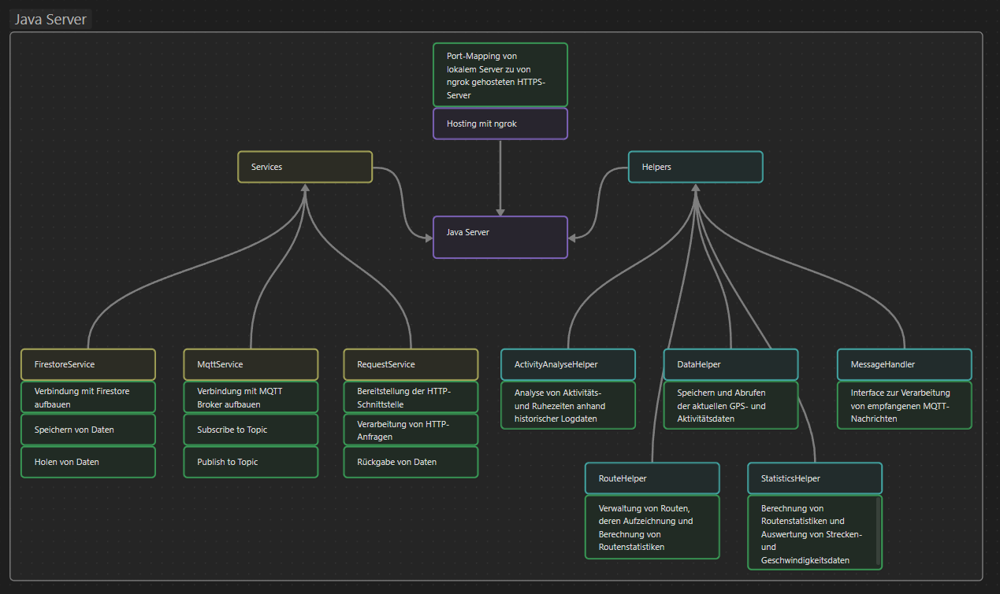
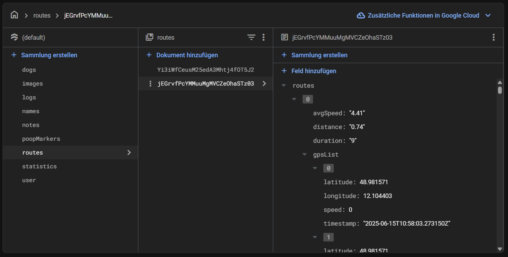

# DAPI Server

##### von Emilia Kötterl und Anton Rauchenberger

-   **Programmiersprache:** Java
-   **Datenkommunikation:** HTTPS API für App, MQTT für Kommunikation mit dem ESP32, Lokales Hosting mittels **ngrok**
-   **Verarbeitung:** Empfang, Verarbeitung und Umwandlung der Sensordaten vom Halsband
-   **Datenbank:** Firebase (Firestore)
-   **Konzept:**

    

    Die Services werden in der Main-Methode mittels Threads gestartet und jeder Service verwendet dabei die Helpers. Das Programm **ngrok** ermöglicht dann den HTTPS-Zugriff von außerhalb auf den lokal gehosteten Server.
    Die aktuelle userID wird im Server noch statisch gesetzt. Für die weitere Entwicklung würde diese dann auch dynamisch platziert werden.

Jeder Benutzer bekommt dabei ein Dokument in jeder Collection (logs, images, dogs, ...) in der Firestore-Datenbank, wo die acountspezifischen Daten dann gespeichert werden:

